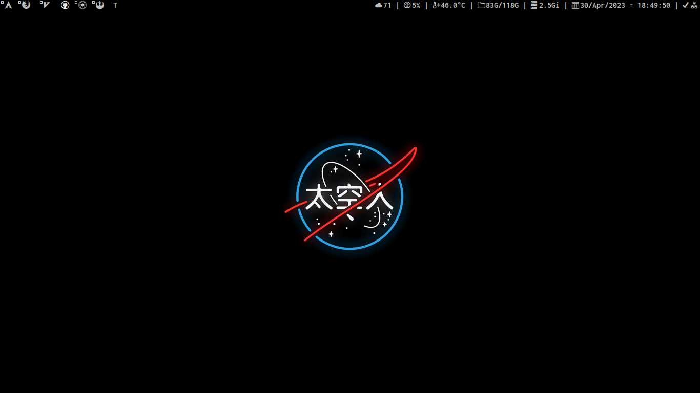
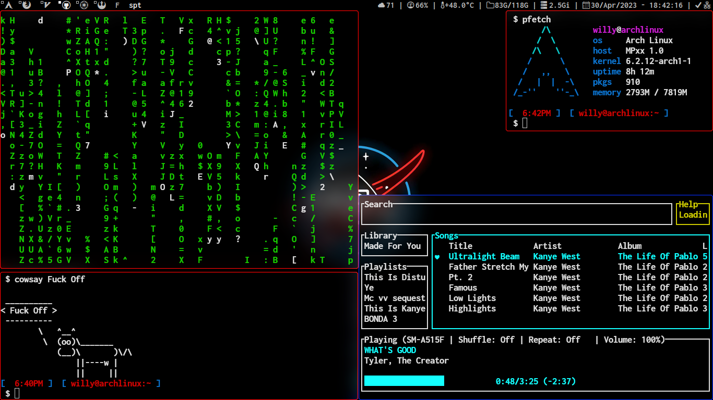

# Arch Linux dotfiles #
## [DWM - Dynamic Window Manager](https://dwm.suckless.org) ##




```py
me = {
    Distro: 'Arch Linux',
    MainEditor: 'Neovim',
    Browser: 'Firefox',
    Shell: 'zsh',
    FrameworkShell: 'oh-my-zsh',
    ProcessViewer: 'htop',

    Music: 'spotifyd + spotify-tui',
    Compositor: 'picom',
    Notify: 'dunst',
    ImageViewer: 'kitty icat',
    MediaPlayer: 'VLC',
    FileManager: 'ranger',

    WindowManager: 'DWM',
    Terminal: 'kitty',
    AppLauncher: 'dmenu',
    Font: 'Inconsolata Nerd Fonts'
}

```