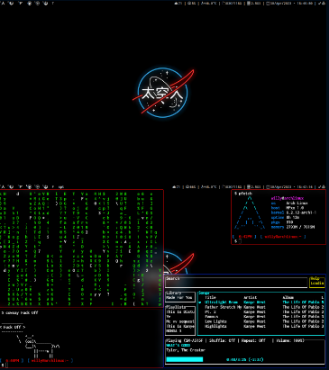

# Arch Linux dotfiles #
## [DWM - Dynamic Window Manager](https://dwm.suckless.org) ##



```py
me = {
    Distro: 'Arch Linux',
    MainEditor: 'Neovim',
    Browser: 'Firefox',
    Shell: 'zsh',
    FrameworkShell: 'oh-my-zsh',
    ProcessViewer: 'htop',

    Music: 'spotifyd + spotify-tui',
    Compositor: 'picom',
    Notify: 'dunst',
    ImageViewer: 'kitty icat',
    MediaPlayer: 'VLC',
    FileManager: 'ranger',

    WindowManager: 'DWM',
    Terminal: 'kitty',
    AppLauncher: 'dmenu',
    Font: 'Inconsolata Nerd Fonts'
}

```

## Files Scheme Tree ##
```py
 .config
├── dunst
│  └── dunstrc
├── kitty
│  └── kitty.conf
├── nvim
│  ├── init.lua
│  └── lua
│     ├── core
│     │  ├── keymaps.lua
│     │  └── settings.lua
│     └── plugins
├── picom
│  └── picom.conf
├── sxhkd
│  └── sxhkdrc
└── termite
   └── config
.newsboat
└── urls
.xinitrc
.zshrc
Scripts
├── connection.py
├── cpu.sh
├── date.py
├── diskfree.sh
├── mem.sh
├── pacmanup.sh
├── rofi-power-menu-master by github.com/jluttine/rofi-power-menu
│  ├── COPYING
│  ├── dmenu-power-menu
│  ├── README.md
│  ├── rofi-power-menu
│  └── screenshot.png
├── rofi.sh
├── set+vol.sh
├── set-vol.sh
└── temp.sh
```